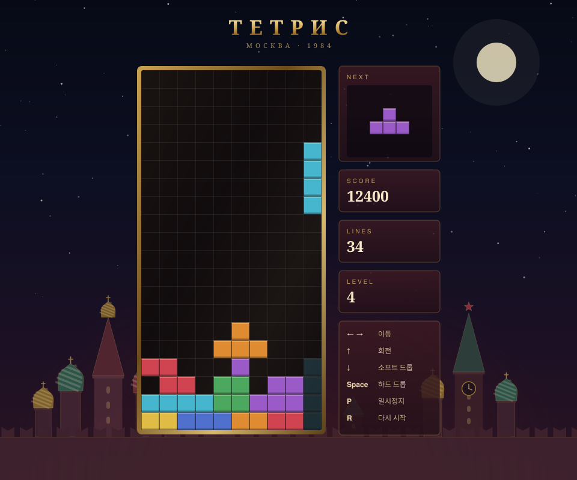

# 크렘린 테트리스 (ТЕТРИС)

HTML 파일 하나로 만든 클래식 테트리스입니다.
테트리스의 고향인 모스크바를 떠올리도록, 성 바실리 대성당과 크렘린 성벽의 밤 풍경을 배경으로 넣었습니다.



### ▶ [바로 플레이하기](https://haeri702.github.io/tetris-game_practice/)

설치나 회원가입 없이 브라우저에서 바로 실행됩니다.

## 플레이 방법

위 링크를 클릭하면 바로 시작됩니다. 내려받아서 실행하고 싶다면:

```bash
git clone https://github.com/haeri702/tetris-game_practice.git
```

받은 폴더의 `index.html` 을 브라우저로 열면 됩니다. 서버를 띄우거나 따로 설치할 것이 없습니다.

## 조작법

**PC — 키보드**

| 키 | 동작 |
|---|---|
| ← → | 좌우로 이동 |
| ↑ | 블록 회전 |
| ↓ | 소프트 드롭 (한 칸씩 빠르게 내리기) |
| Space | 하드 드롭 (바닥까지 한 번에 내리기) |
| P | 일시정지 / 다시 시작 |
| R | 게임 처음부터 다시 |

**휴대폰 — 화면 버튼 또는 제스처**

화면 아래 버튼으로 조작할 수 있고, 게임판을 직접 쓸어서 움직여도 됩니다.

| 제스처 | 동작 |
|---|---|
| 좌우로 끌기 | 끈 만큼 좌우로 이동 |
| 아래로 끌기 | 소프트 드롭 |
| 톡 누르기 | 블록 회전 |
| 위로 튕기기 | 하드 드롭 |

화면 크기에 맞춰 게임판 크기가 자동으로 조정되므로, 작은 휴대폰에서도 스크롤 없이 한 화면에 들어옵니다.

## 게임 규칙

블록을 쌓아서 가로 한 줄을 빈칸 없이 채우면 그 줄이 사라집니다.
블록이 위까지 쌓여서 새 블록이 나올 자리가 없으면 게임 오버입니다.

**점수**

| 상황 | 점수 |
|---|---|
| 1줄 삭제 | 100 × 레벨 |
| 2줄 동시 삭제 | 300 × 레벨 |
| 3줄 동시 삭제 | 500 × 레벨 |
| 4줄 동시 삭제 (테트리스) | 800 × 레벨 |
| 소프트 드롭 | 1칸당 1점 |
| 하드 드롭 | 1칸당 2점 |

한 번에 여러 줄을 지울수록 점수가 훨씬 크므로, 한 줄씩 지우기보다 4줄을 모아서 지우는 쪽이 유리합니다.

**레벨**

10줄을 지울 때마다 레벨이 1 올라가고, 블록이 내려오는 속도가 빨라집니다.
1레벨은 1초에 한 칸씩 내려오고, 레벨이 오를 때마다 0.08초씩 빨라져 최대 0.1초까지 단축됩니다.

## 구현 특징

- **7-bag 랜덤** — 7종류 블록을 한 묶음으로 섞어서 꺼내기 때문에, 같은 블록만 계속 나오거나 원하는 블록이 한참 안 나오는 상황이 생기지 않습니다.
- **월 킥(wall kick)** — 벽이나 다른 블록에 딱 붙은 상태에서 회전하면, 자동으로 좌우로 살짝 밀어서 회전이 성공하도록 보정합니다.
- **고스트 블록** — 지금 블록이 어디에 떨어질지 반투명하게 미리 보여줍니다.
- **다음 블록 미리보기** — 다음에 나올 블록을 확인하고 미리 자리를 잡을 수 있습니다.
- **배경이 이미지가 아님** — 대성당의 양파 돔, 성벽의 총안, 붉은 별까지 전부 코드로 그린 SVG입니다. 그래서 파일 하나만 있으면 어디서든 똑같이 보입니다.

## 파일 구조

```
index.html    게임 전체 (HTML + CSS + JavaScript)
preview.svg   README에 쓰는 게임 화면 이미지
og-image.png  카카오톡 등에 링크를 공유할 때 뜨는 썸네일
README.md     이 문서
```

라이브러리나 빌드 도구를 쓰지 않았습니다. `index.html` 안에서 배경 드로잉 코드와 게임 로직이 주석으로 구분되어 있습니다.
